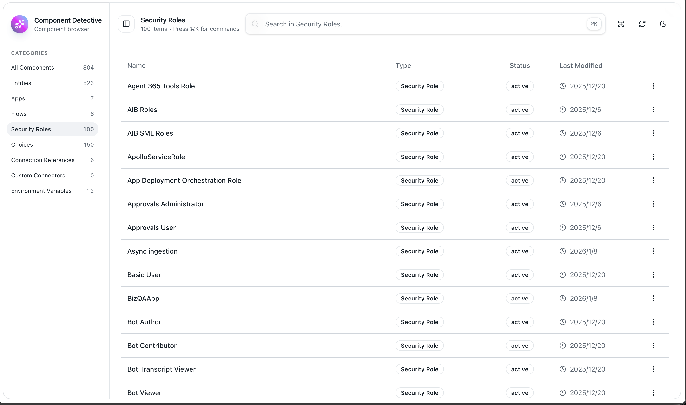

# Component Detective

A lightweight **Microsoft Dataverse / Power Platform** component browser (Web Resource): quickly search/filter solution components in the browser, inspect common metadata, and jump to entry points like Maker Portal / Flow Editor.

> Designed to run as a **Power Platform Web Resource**: calls the Dataverse Web API directly via same-origin `/api/data/v9.2` (using the current signed-in user's permissions).

## Screenshot




## Features

- Browse by category: Entities / Apps / Flows / Security Roles / Choices / Connection References / Custom Connectors / Environment Variables
- Component search: server-side search via `msdyn_solutioncomponentsummaries` (supports category filtering; also supports ID/GUID search)
- Command palette: `Ctrl/⌘ + K` to quickly open search/actions
- Detail panel: view basic properties + list of Solutions (with one-click open to the Solution page in Maker Portal)
- Deep links
  - Model-driven App: Play / open editor in a new tab
  - Canvas App: open editor in a new tab
  - Flow: open in Flow Editor
  - Security Role: open role editor in Maker Portal
  - Entity: open the configured “metadata viewer page” (defaults to integrating with `Dataverse Detective`)
- Light/Dark mode

## Getting Started

### Prerequisites

- Node.js 18+ (20+ recommended)
- pnpm

### Install

```bash
pnpm install
```

### Dev

```bash
pnpm dev
```

Notes:
- This project requests `/api/data/v9.2` by default, so local development usually can't access Dataverse directly (same-origin + authenticated org context required).
- Recommended validation: import it into Dataverse and open it under your org domain for end-to-end testing.
- `index_debug.html` is provided (points to `http://localhost:5173`) as a debugging entry: open it in your org, but load assets from your local Vite server (publish it as a Web Resource yourself).

## Build

```bash
pnpm build
```

Build outputs are written to `dist/` with fixed filenames (no hash) for easy publishing as Web Resources:
- `index.html`
- `objectexplorer.js`
- `objectexplorer.css`

## Package as Power Platform Solution

Package the built `dist/` outputs into a Solution (Web Resources) that can be imported directly into Power Platform:

```bash
pnpm build:solution
```

Output: `solution/out/component_detective_unmanaged.zip`

Dependencies:
- The packaging script calls the system `zip` command; it's typically built-in on macOS/Linux. On Windows, install `zip` yourself or use WSL.

## Import & Open

- Power Apps Maker Portal → Solutions → Import → 选择 `solution/out/component_detective_unmanaged.zip`
- After import, the following Web Resources will be created:
  - `util_/component_detective/index.html`
  - `util_/component_detective/index.js`
  - `util_/component_detective/index.css`
- Direct access example (replace with your org domain):
  - `https://<your-org>.crm.dynamics.com/WebResources/util_/component_detective/index.html`

## Config

Configure integration pages in `src/config.ts`:
- `config.webResource.entityMetadataPage`: the Web Resource opened by the Entity row action “View Metadata” (defaults to `util_/dataverse_detective/index.html`)

## Scripts

- `pnpm dev`: start the dev server
- `pnpm build`: build for production
- `pnpm preview`: preview the production build
- `pnpm build:solution`: build and package the Solution
- `pnpm pack:solution`: package the Solution only (run `pnpm build` first)

## Tech Stack

React + TypeScript + Vite + Tailwind CSS + shadcn/ui + Framer Motion

## Contributing

- Issues and PRs are welcome

## License

MIT License
